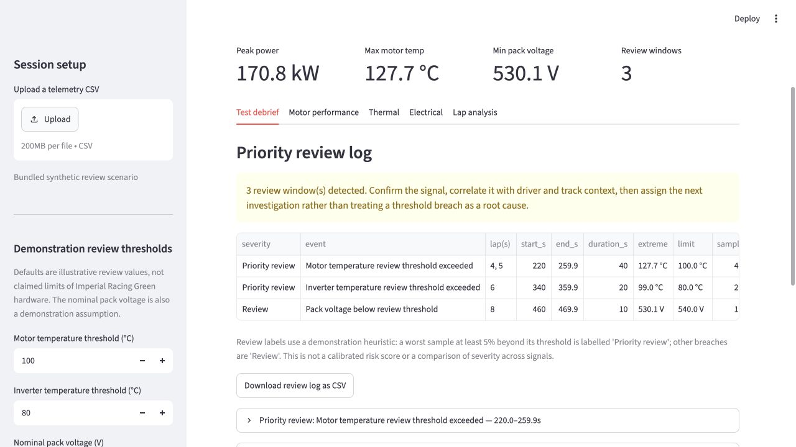

# Formula Student EV Test-Data Debrief

Independent engineering portfolio prototype for turning EV drivetrain telemetry into a structured post-run review.

> **Independent project by HJ Nakamura.** The public demonstration uses synthetic data with physically consistent mechanical/electrical power relationships and deliberately injected review scenarios, so the full analysis workflow can be shared without publishing private team telemetry. **It is not an official Imperial Formula Student tool or team dataset, and has not been deployed by the team.**

[](https://imperial-fs-telemetry.streamlit.app/)
[](https://github.com/hj-nakamura421/imperial-fs-telemetry/actions/workflows/ci.yml)

**Live application:** [imperial-fs-telemetry.streamlit.app](https://imperial-fs-telemetry.streamlit.app/)

**Physical engineering → test data → calculations → engineering judgement → next action.** The debrief connects thermal and voltage-sag events with timestamped energy calculations and a specific next investigation.



*Bundled synthetic scenario with illustrative review thresholds. The screenshot can be reviewed without waiting for the live application to wake up.*

## What I engineered

- **Telemetry validation and data-contract checks** — required columns, numeric and finite values, time ordering and lap numbering in [telemetry.py](telemetry.py).
- **Event detection and grouping into review windows** — time, duration, affected laps, worst value and a next investigation for each breach.
- **Timestamp-aware mechanical/electrical energy integration** — trapezoidal integration for session and lap summaries.
- **Synthetic EV test-data generator** — reproducible power relationships and targeted review scenarios in [data_generator.py](data_generator.py).
- **Streamlit interface and Plotly visualisation** — an interactive debrief, signal plots and an exportable review log in [app.py](app.py).
- **Automated tests and CI** — calculation, validation and scenario checks in [tests/test_telemetry.py](tests/test_telemetry.py), run by [GitHub Actions](.github/workflows/ci.yml).

## The engineering problem

After a test run, an engineer needs decisions quickly—not a dashboard full of unrelated traces. This tool addresses the practical first questions in an EV drivetrain debrief:

| Review question | Implementation |
| --- | --- |
| Did a motor or inverter temperature cross a review threshold? | Consecutive threshold breaches are grouped into timestamped review windows. |
| Did the accumulator sag under load? | Pack-voltage events are flagged alongside the minimum voltage and maximum sag. |
| Did energy demand change from lap to lap? | Mechanical and electrical power are integrated over each lap using the recorded timestamps. |
| Can this uploaded log be trusted enough to interpret? | The input schema, numeric fields, time ordering, and lap numbering are validated before analysis. |
| What should happen next? | Each review window includes a deliberately specific engineering prompt, such as checking coolant flow, torque demand or BMS limits. |

The bundled scenario deliberately creates one motor-temperature event, one inverter-temperature event and one voltage-sag event, so the end-to-end review path can be tested and demonstrated.

## Why the synthetic data are technically meaningful

The [generator](data_generator.py) produces a deterministic ten-lap, 10 Hz session with a fixed random seed. Its power signals are coupled through explicit engineering relationships:

- **Mechanical power:** `P_mech = torque × RPM × (2π / 60) / 1000` in kW.
- **Electrical demand:** `P_elec = P_mech / 0.91`, using an assumed constant 91% drivetrain efficiency.
- **Baseline pack model:** `V_pack = 600 − I × 0.05`, with voltage in V, current in A and resistance in Ω. Current is solved from `1000 × P_elec = V_pack × I`, converting the electrical demand from kW to W.

To exercise the review workflow, the generator injects motor heating at 220–260 s, inverter heating at 340–360 s, and an extra 65 V pack-voltage drop at 460–470 s. In the sag window, current is recalculated to preserve the electrical power demand; the extra drop is an imposed scenario, not a prediction from the fixed-resistance model. Temperatures are scripted signals, not outputs of a calibrated thermal model.

This is a physically motivated demonstration dataset designed to test specific failure-review scenarios. The model values are assumptions, not measured Imperial Racing Green parameters; the resulting 91% energy ratio verifies internal consistency rather than demonstrating measured vehicle efficiency.

## Demonstration thresholds and review labels

**Default limits are illustrative review thresholds for the public demonstration and are not claimed to represent the limits of Imperial Racing Green hardware.**

| Signal | Default review condition |
| --- | --- |
| Motor temperature | Above 100 °C |
| Inverter temperature | Above 80 °C |
| Pack voltage | Below 540 V |

All thresholds are adjustable in the sidebar. The separate 600 V nominal-pack input is a demonstration reference used to calculate voltage sag, not a verified hardware specification.

The `Priority review` label uses a simple **demonstration heuristic**: the worst sample is at least 5% beyond that signal's configured threshold; smaller breaches are labelled `Review`. This is not a calibrated risk score or a ranking across different physical signals. In particular, a percentage of a Celsius threshold is scale-dependent. Engineering interpretation still requires appropriate hardware limits, event duration, operating context and signal validation.

## What makes this more than a chart

- **Timestamp-aware energy accounting.** Mechanical power and `voltage × current` electrical power are integrated with the trapezoidal rule, rather than assuming a fixed sampling period.
- **Review windows, not thousands of red points.** Adjacent samples over a threshold are collapsed into one event with duration, affected laps, worst value, a heuristic review label and an investigation prompt.
- **Transparent assumptions.** Nominal pack voltage and review thresholds are explicit, adjustable inputs; estimated drivetrain efficiency is marked as a first-pass diagnostic, not a calibrated loss model.
- **Reliable input handling.** Invalid CSVs fail with a useful validation message before plots or metrics are produced.
- **Tested analysis layer.** The event grouping, energy calculations, validation and demonstration scenario are covered by automated tests and GitHub Actions.

## Run it locally

```bash
uv sync --dev
uv run python data_generator.py
uv run streamlit run app.py
```

To run the tests:

```bash
uv run pytest
```

## CSV contract

Upload a CSV with these columns:

```text
time_s, lap, motor_rpm, motor_torque_nm, power_kw,
motor_temp_c, inverter_temp_c, battery_voltage_v, battery_current_a
```

`time_s` must be ordered from earliest to latest. All signals must be numeric, and `lap` must contain positive integers.

## Engineering workflow

```text
test log → schema checks → signal/event detection → energy & lap summary → review log → targeted follow-up
```

This repository is intentionally scoped as a portfolio-quality analysis prototype. A truthful team case study would next use a permissioned, anonymised real test log and document the resulting investigation or engineering decision.

## Future work

- SOC-aware voltage-sag modelling, including open-circuit voltage and temperature-dependent pack resistance.
- Explicit logging-gap reporting and energy integration that does not bridge missing intervals. Event grouping already splits sufficiently separated samples; it is not a full logging-quality check.
- Sensor plausibility and rate-of-change checks using documented sensor specifications.
- Torque/RPM/power consistency validation for uploaded logs; the generator already derives mechanical power from torque and RPM.
- Validation against real telemetry with team permission, approved hardware thresholds and a documented follow-up investigation.

## Stack

Python · pandas · NumPy · Streamlit · Plotly · pytest · GitHub Actions

Built by [HJ Nakamura](https://github.com/hj-nakamura421), Mechanical Engineering student at Imperial College London.
